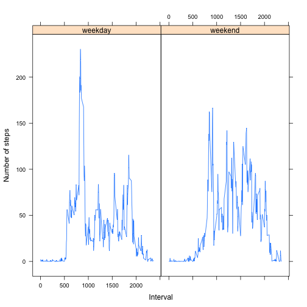

# Reproducible Research: Peer Assessment 1

This is the first peer assessment project in Reproducible Research course on Coursera.

## Loading and preprocessing the data

First, I loaded data and took a look. There are total 2304 missing values in step vairable.


```r
activity <- read.csv("activity.csv", header = T)
summary(activity)
```

```
##      steps               date          interval   
##  Min.   :  0.0   2012-10-01:  288   Min.   :   0  
##  1st Qu.:  0.0   2012-10-02:  288   1st Qu.: 589  
##  Median :  0.0   2012-10-03:  288   Median :1178  
##  Mean   : 37.4   2012-10-04:  288   Mean   :1178  
##  3rd Qu.: 12.0   2012-10-05:  288   3rd Qu.:1766  
##  Max.   :806.0   2012-10-06:  288   Max.   :2355  
##  NA's   :2304    (Other)   :15840
```


Then, I subset the data and put data with missing values into another data frame.


```r
clean_activity <- activity[!is.na(activity$step), ]
missing_activity <- activity[is.na(activity$step), ]
summary(clean_activity)
```

```
##      steps               date          interval   
##  Min.   :  0.0   2012-10-02:  288   Min.   :   0  
##  1st Qu.:  0.0   2012-10-03:  288   1st Qu.: 589  
##  Median :  0.0   2012-10-04:  288   Median :1178  
##  Mean   : 37.4   2012-10-05:  288   Mean   :1178  
##  3rd Qu.: 12.0   2012-10-06:  288   3rd Qu.:1766  
##  Max.   :806.0   2012-10-07:  288   Max.   :2355  
##                  (Other)   :13536
```


After processing the data, there is no missing values in clean_activity data frame.

## What is mean total number of steps taken per day?

```r
total_step <- tapply(clean_activity$step, clean_activity$date, sum)
library(lattice)
histogram(total_step, type = c("count"), xlab = "Total number of steps taken each day")
```

 


```r
mean(total_step, na.rm = T)
```

```
## [1] 10766
```

```r
median(total_step, na.rm = T)
```

```
## [1] 10765
```

It is obvious that the mean number of steps taken each day is 10766, while the median number is 10765.

## What is the average daily activity pattern?

```r
avg_step <- tapply(activity$step, activity$interval, function(x) {
    mean(x, na.rm = T)
})
max_step <- max(avg_step)
plot(unique(activity$interval), avg_step, type = "l", xlab = "5-minute interval", 
    ylab = "Average number of steps taken")
abline(v = names(avg_step)[avg_step == max_step], col = "Red", lwd = 2)
```

 

```r
avg_step[avg_step == max_step]
```

```
##   835 
## 206.2
```

From above graph and output, it is obvious that the maximum number of steps on average across all days is 835th 5-minute interval.
## Imputing missing values


```r
missing_val <- sum(is.na(activity))
```

The total number of missing values in the dataset is 2304.

I devised a strategy for filling all of the missing values in the dataset. The strategy used the mean for that 5-minute interval to fill the missing value. For example, the mean of 5th 5-minute interval without missing values is 50. On 2012-10-01, the value of step in 5th 5-minute interval is missing. Then, I would use 50, the mean of 5th 5-minute interval without missing values, to replace the missing value.


```r
new_activity <- data.frame()
for (i in 1:288) {
    intervals <- unique(activity$interval)
    tem_activity <- subset(activity, interval == intervals[i])
    avg <- mean(tem_activity$steps, na.rm = T)
    if (is.nan(avg)) {
        tem_activity$steps[is.na(tem_activity$step)] <- 0
    } else {
        tem_activity$steps[is.na(tem_activity$step)] <- avg
    }
    new_activity <- rbind(new_activity, tem_activity)
}

new_activity <- new_activity[order(new_activity$date), ]
summary(new_activity)
```

```
##      steps               date          interval   
##  Min.   :  0.0   2012-10-01:  288   Min.   :   0  
##  1st Qu.:  0.0   2012-10-02:  288   1st Qu.: 589  
##  Median :  0.0   2012-10-03:  288   Median :1178  
##  Mean   : 37.4   2012-10-04:  288   Mean   :1178  
##  3rd Qu.: 27.0   2012-10-05:  288   3rd Qu.:1766  
##  Max.   :806.0   2012-10-06:  288   Max.   :2355  
##                  (Other)   :15840
```

The following first graph is the histogram of the total number of steps taken each day without filling the missing values.

```r
histogram(total_step, type = c("count"), xlab = "Total number of steps taken each day", 
    main = "Before filling")
```

 

The second graph is is the histogram of the total number of steps taken each day after filling the missing values.

```r
total_step2 <- tapply(new_activity$step, new_activity$date, sum)
histogram(total_step2, type = c("count"), xlab = "Total number of steps taken each day", 
    main = "After filling")
```

 

```r
mean(total_step2, na.rm = T)
```

```
## [1] 10766
```

```r
median(total_step2, na.rm = T)
```

```
## [1] 10766
```

It is easy to see that maximum round 10000 steps increased from around 18 to around 26. Also, the median number of steps taken each day increased from 10765 to 10766. The impact of imputing missing data is to increase median number of steps because before filling missing value, there are no values of step on 2012-10-01, 2012-10-08,2012-11-01. Using mean for that 5-minute interval to fill the missing value should increase those values of steps on 2012-10-01, 2012-10-08, and other dates. Finally, this change would influence the median number of steps taken each day.
## Are there differences in activity patterns between weekdays and weekends?
In this part, I created a new factor variable in the dataset with two levels – “weekday” and “weekend” indicating whether a given date is a weekday or weekend day. 

```r
new_activity$date <- as.Date(levels(new_activity$date)[new_activity$date])
new_activity$week <- weekdays(new_activity$date)
new_activity$day <- "weekday"
new_activity$day[new_activity$week == "Saturday" | new_activity$week == "Sunday"] <- "weekend"
new_activity$day <- factor(new_activity$day)
new_activity <- new_activity[, -4]
head(new_activity)
```

```
##     steps       date interval     day
## 1 1.71698 2012-10-01        0 weekday
## 2 0.33962 2012-10-01        5 weekday
## 3 0.13208 2012-10-01       10 weekday
## 4 0.15094 2012-10-01       15 weekday
## 5 0.07547 2012-10-01       20 weekday
## 6 2.09434 2012-10-01       25 weekday
```


```r
library(doBy)
```

```
## Loading required package: survival
## Loading required package: splines
## Loading required package: MASS
```

```r
avg_step2 <- summaryBy(formula = steps ~ interval + day, data = new_activity, 
    FUN = mean)
avg_step2 <- data.frame(avg_step2)
xyplot(avg_step2$steps.mean ~ avg_step2$interval | avg_step2$day, type = "l", 
    xlab = "Interval", ylab = "Number of steps")
```

 


From above two line graphs, we can see that around 900th 5-minute interval, number of steps during weekday is much higher than its counterpart during weenkends. At the same time, between 1000th and 2000th 5-minute interval, number of step fluctuates fiercely during weekends. 
